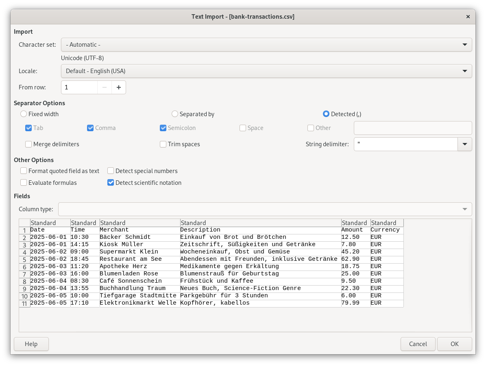

# csv-to-ods

CLI tool to convert csv files into Open Document Spreadsheet files.

Powered by [rechenbrett](https://github.com/fwilhe2/rechenbrett).

Related: [json-to-ods](https://github.com/fwilhe2/json-to-ods)

## Why

Many applications such as online banking only provide a csv export.
Opening csv files in spreadsheet applications is not a great experience.



With csv-to-ods, you can create proper spreadsheet files with type information and sensible formatting.

See `sample.csv` and `sample.csv.options.json`.

The options file is optional, but allows you to specify data types which gives you a much more usable spreadsheet file where numbers, dates and currencies are formatted properly.

The format for the settings file is this:

```yaml
{
    # Number of header lines; as some csv files have more than one header line
    # In header lines, all cells are interpreted as strings
    "headerLines": 1,
    # The char used as a separator, common options are: , ; \t
    "comma": ",",
    # Data types in cells for each column
    "types": [
        "string",
        "float",
        "float",
        "currency"
    ]
}
```

Use the cli like in this example:

```bash
csv-to-ods -input input.csv -flat -output output.fods
```

This will produce an Open Document Spreadsheet file.

If you omit the `flat` flag, a zipped Open Document Spreadsheet file will be created.
Use the `.ods` file extension in that case.

Check the [samples](./samples/) directory for more sample files.

## License

This software is written by Florian Wilhelm and available under the MIT license (see `LICENSE` for details)
